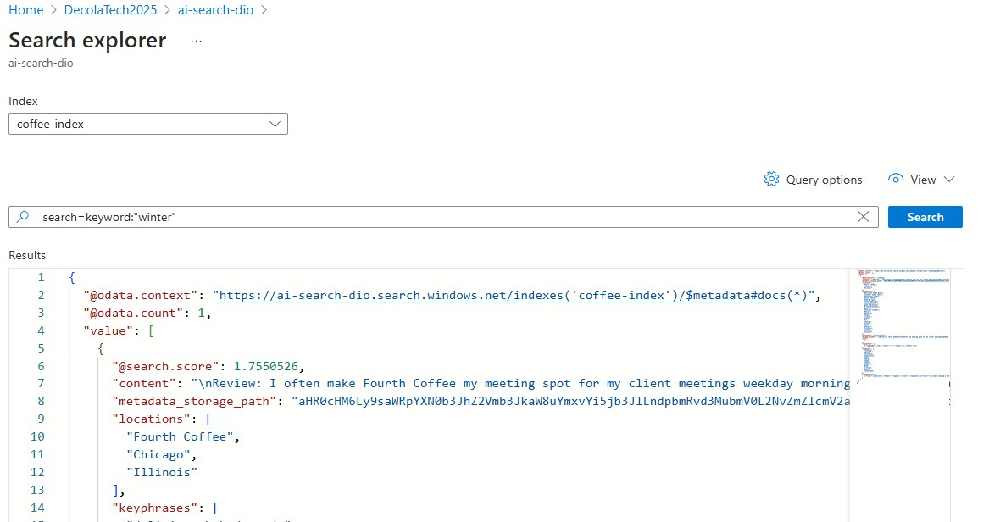
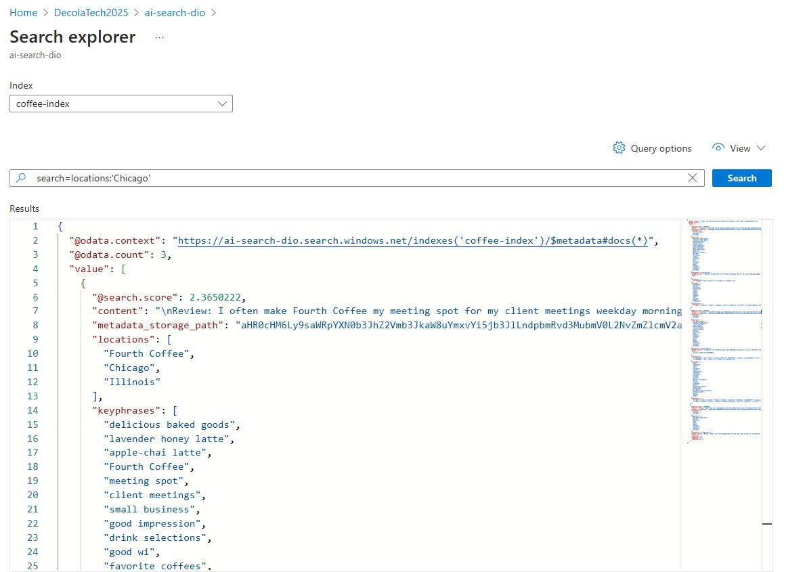
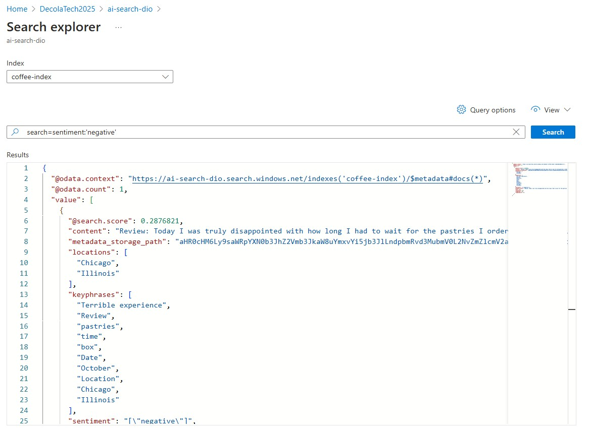
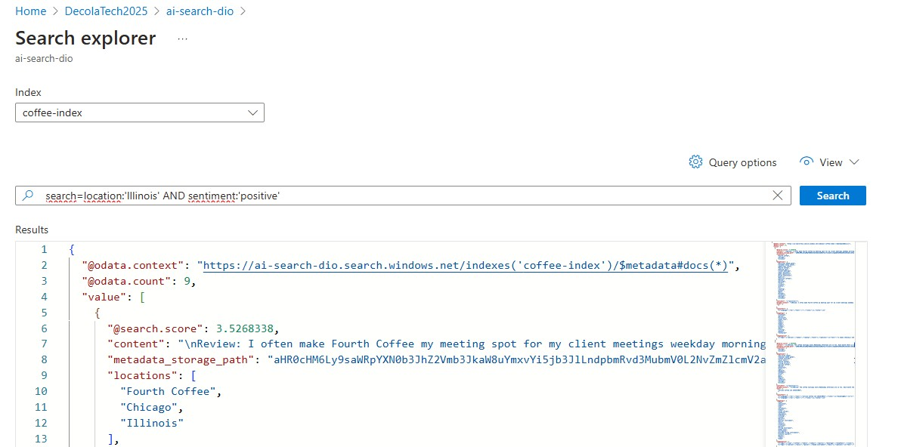

# Pesquisa Cognitiva com IA do Azure

## Descrição

O laboratório demonstrou como configurar um sistema de pesquisa cognitiva utilizando serviços de IA do Azure, incluindo Azure AI Search, Azure AI Services (Language Studio, etc.) e Azure Storage Account. O objetivo é criar uma solução que permita realizar pesquisas rápidas e precisas em documentos armazenados, com funcionalidades avançadas como análise de sentimento e extração de informações contextuais.

## Arquitetura

A arquitetura do projeto consiste em:

1.  **Azure Storage Account:** Armazenamento dos documentos a serem pesquisados.
2.  **Azure AI Search:** Serviço de pesquisa cognitiva que indexa os documentos e permite realizar consultas complexas.
3.  **Azure AI Services (Language Studio):** Utilizado para análise de sentimento, extração de entidades e outras funcionalidades de processamento de linguagem natural.

## Configuração e Testes Realizados

1.  **Criação de Recursos no Azure:**
    * Criamos uma conta de armazenamento (Storage Account) para simular o armazenamento de documentos.
    * Criamos um serviço de pesquisa (Azure AI Search) para indexar e pesquisar os documentos.
    * Criamos um recurso de serviços de IA (Azure AI Services) para utilizar as funcionalidades do Language Studio.

2.  **Simulação de Armazenamento de Documentos:**
    * Carregamos documentos de teste da pasta reviews (DOCX) na conta de armazenamento para simular um ambiente de produção.

3.  **Configuração de Indexação no Azure AI Search:**
    * Configuramos um indexador no Azure AI Search para conectar-se à conta de armazenamento e indexar os documentos de teste.
    * Definimos os campos do índice para permitir pesquisas por palavras-chave e outros critérios relevantes.
    * Utilizamos o Language Studio para analisar o sentimento dos documentos e extrair frases-chave, enriquecendo os dados indexados.

4.  **Testes de Pesquisa no Portal do Azure:**
    * Realizamos pesquisas no portal do Azure AI Search para testar as funcionalidades de pesquisa por palavras-chave, sentimento e entidades.
    * Avaliamos a relevância dos resultados e a precisão das informações extraídas.

**Observação:** Este projeto focou na exploração das funcionalidades dos serviços de IA do Azure através do portal do Azure, sem a implementação de APIs para integração em aplicações externas.

## Tipos de Pesquisa

* **Pesquisa por palavras-chave:** Busca por termos específicos nos documentos.
    
     
* **Pesquisa por localização:** Filtragem de documentos com base em informações de localização (se presentes). 
    
     
* **Pesquisa por sentimento:** Filtragem de documentos com base na análise de opiniões (positivo, negativo, neutro). 
    
     
* **Pesquisa por localização e sentimento:** Permite filtrar documentos com base na localização mencionada e no sentimento expresso no conteúdo.
    

## Insights e Aprendizados

* A integração de serviços de IA do Azure permite criar soluções de pesquisa poderosas e personalizadas.
* A análise de sentimento e a extração de entidades enriquecem os resultados da pesquisa, fornecendo informações contextuais relevantes.
* A automação do processo de indexação e pesquisa economiza tempo e recursos.
* A flexibilidade dos serviços de IA do Azure permite adaptá-los a diferentes tipos de documentos e casos de uso.

## Ferramentas Beneficiadas

* **Sistemas de atendimento ao cliente:** Para fornecer respostas rápidas e precisas a perguntas dos clientes.
* **Plataformas de e-commerce:** Para melhorar a pesquisa de produtos e fornecer recomendações personalizadas.
* **Sistemas de gestão de documentos:** Para facilitar a busca e recuperação de informações em grandes volumes de documentos.
* **Aplicações de análise de dados:** Para identificar padrões e tendências em dados não estruturados.

